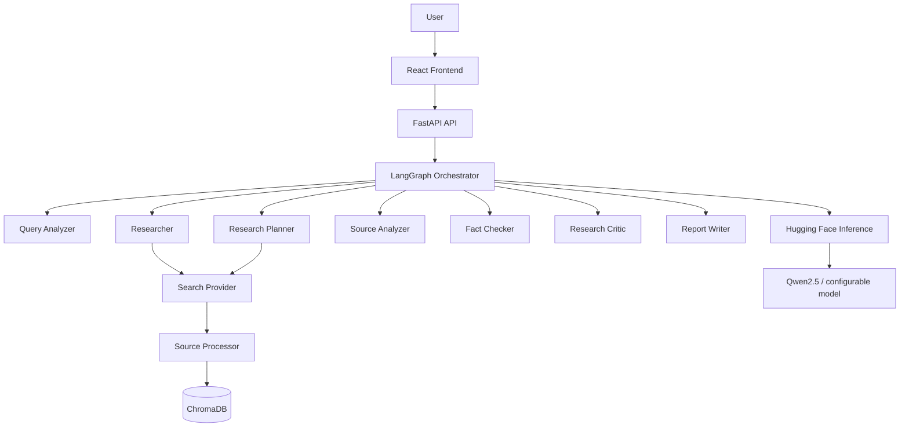

# OpenResearch

**An open-source multi-agent AI research assistant built with LangGraph and Hugging Face models.**

OpenResearch takes a research question, plans the investigation, searches the web,
collects and analyzes sources, fact-checks claims, iterates on gaps, and produces a
structured, cited report — orchestrated entirely by a LangGraph state machine running
on Hugging Face hosted inference. No local GPU required; run on any VPS with an HF token.

---

## Features

- **Multi-agent architecture** — query analyzer, research planner, search agent,
  source analyzer, fact checker, research critic, report writer, and reviewer.
- **Iterative research loop** — the graph evaluates evidence coverage and re-searches
  until a satisfactory answer is reached (bounded by `MAX_RESEARCH_ITERATIONS`).
- **LangGraph orchestration** — typed state, conditional edges, checkpointing, and
  error recovery.
- **Free-first by design** — Hugging Face hosted inference (no local GPU), DuckDuckGo
  search by default, and optional pluggable providers (e.g. Tavily) that never gate
  core functionality.
- **Citation-first reporting** — every factual claim maps back to a collected source.
- **RAG-ready** — document upload, chunking, embeddings, and vector search (ChromaDB).
- **FastAPI backend** — typed schemas, streaming progress, health endpoint, SQLite
  persistence (PostgreSQL-ready).
- **Modern frontend** — React + TypeScript + Tailwind, dark/light mode, live research
  progress, and a graph visualization of the workflow.

## Architecture



## Tech Stack

| Layer      | Technology                                              |
| ---------- | ------------------------------------------------------- |
| Orchestration | LangGraph, LangChain                                |
| Backend    | Python, FastAPI, SQLAlchemy, SQLite                      |
| LLM        | Hugging Face hosted inference (no local GPU required)     |
| Search     | DuckDuckGo (default), Tavily (optional)                  |
| Storage    | SQLite, ChromaDB                                         |
| Frontend   | React, TypeScript, Tailwind CSS, Vite                    |
| Ops        | Docker, GitHub Actions, Ruff, MyPy, Pytest               |

## Quick Start

Requirements: **Python 3.11+**, **Node.js 20+**, **Docker** (optional), **Git**, a [Hugging Face](https://huggingface.co) account with an inference provider enabled.

```bash
git clone <repository-url>
cd openresearch-langgraph
```

### Backend

```bash
cd backend
python -m venv .venv
source .venv/bin/activate        # Windows: .venv\Scripts\activate
pip install -r requirements.txt
uvicorn app.main:app --reload    # http://localhost:8000/docs
```

### Frontend

```bash
cd frontend
npm install
npm run dev                      # http://localhost:5173
```

Copy `.env.example` to `.env` and adjust values as needed.

### Docker Compose

```bash
cp .env.example .env          # fill in HF_TOKEN
docker compose up --build          # frontend:5173, backend:8000
```

See [`docs/deployment.md`](docs/deployment.md) for details.

## Project Status

All 23 phases complete. See [`docs/development.md`](docs/development.md).

- [x] Phase 1 — Project initialization (repo, backend & frontend skeletons, config)
- [x] Phase 2 — LLM provider integration (Hugging Face hosted)
- [x] Phases 3–17 — LangGraph workflow, agents, API, frontend, RAG
- [x] Phases 18–23 — Tests, Docker, CI/CD, documentation, deployment

## Contributing & Security

- [Contributing](CONTRIBUTING.md)
- [Code of Conduct](CODE_OF_CONDUCT.md)
- [Security policy](SECURITY.md) — report vulnerabilities privately

## License

[MIT](LICENSE)